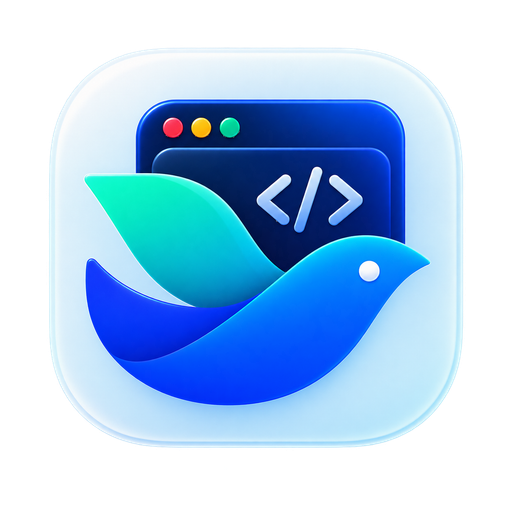
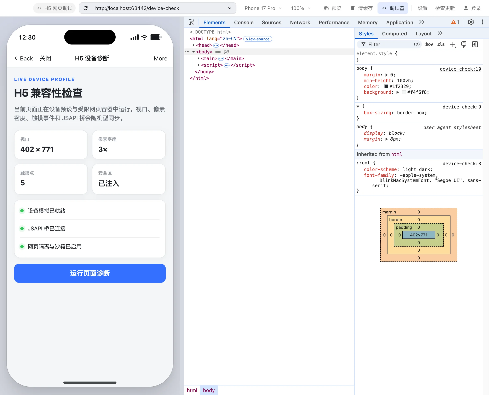

<p align="center">
  
</p>
<h1 align="center">Larto</h1>
<p align="center">
  跨平台飞书 / Lark H5 调试工作台<br />
  macOS Apple Silicon / Intel · Windows x64 · Linux x64 · 本机 MCP
</p>
<p align="center">
  <a href="https://ihopefulchina.github.io/Larto/">官网与下载</a> ·
  <a href="https://github.com/ihopefulChina/Larto/releases/latest">GitHub Releases</a> ·
  <a href="https://www.npmjs.com/package/larto-mcp">MCP npm 包</a> ·
  <a href="CHANGELOG.md">变更记录</a> ·
  <a href="SECURITY.md">安全政策</a> ·
  <a href="docs/ARCHITECTURE.md">架构</a>
</p>

<p align="center">
  <picture>
    <source srcset="website/public/hero-dark.webp" media="(prefers-color-scheme: dark)" />
    
  </picture>
</p>

Larto 专注复现官方开发者工具的「网页调试」工作流：在同一窗口运行设备模拟器与完整 Chromium DevTools，通过飞书扫码登录验证真实 JSAPI 鉴权，并让 Cursor、Claude、Codex 等 AI 客户端通过 MCP 操作调试器。

> [!IMPORTANT]
> Larto 是独立开源项目，不是飞书官方产品。当前只覆盖飞书 / Lark H5；小程序、网关、工作台、代码编辑器和上传能力不在范围内。

## 能力

| 模块 | 已实现 |
| --- | --- |
| 设备模拟 | iPhone、Android、iPad、PC 预设；默认 iPhone 17 Pro；viewport、DPR、安全区、状态栏与 `Lark/x.y.z` UA 同步切换 |
| PC 视口 | 随窗口伸缩；可拖动右下角或输入宽高固定 viewport |
| Chromium DevTools | Elements、Console、Sources、Network、Application 等面板停靠在主窗口右侧；支持直接选择模拟器中的元素 |
| 飞书登录 | passport 扫码登录、多租户切换；受保护后端可用时通过 Electron `safeStorage` 持久化，否则仅在当前进程保留 |
| JSAPI | `tt.config`、`requestAuthCode`、`requestAccess` 请求真实开放平台；剪贴板、定位、Toast、Modal、ActionSheet、Preloader、导航栏、链接与图片预览等本机模拟能力 |
| 真机预览 | 生成 `lark://client/web?isDev=1&url=…` 二维码或推送本机飞书；`localhost` 自动转换为局域网地址 |
| 日常工具 | 地址历史、清缓存、深色 / 浅色 / 跟随系统、中英文、GitHub Releases 更新检查 |
| MCP | 18 个工具，覆盖导航、设备、缩放、主题、截图、DOM、脚本、控制台与 JSAPI 调用记录 |

## 下载 0.1.2

所有安装包由 GitHub Release 工作流按原生平台构建，文件名明确包含系统与架构。下载后建议先核对同一 Release 中的 `SHA256SUMS.txt`。

| 平台 | 架构 | 包格式 | 文件名 |
| --- | --- | --- | --- |
| macOS 13+ | Apple Silicon / arm64 | DMG、ZIP | `Larto-0.1.2-mac-arm64.{dmg,zip}` |
| macOS 13+ | Intel / x64 | DMG、ZIP | `Larto-0.1.2-mac-x64.{dmg,zip}` |
| Windows 10/11 | x64 | NSIS 安装版、便携版、ZIP | `Larto-0.1.2-windows-x64-setup.exe`、`…-portable.exe`、`…-x64.zip` |
| Linux | x64 | AppImage、DEB、RPM、tar.gz | `Larto-0.1.2-linux-x64.{AppImage,deb,rpm,tar.gz}` |

### macOS

1. M1 / M2 / M3 / M4 等芯片下载 `mac-arm64.dmg`；Intel Mac 下载 `mac-x64.dmg`。
2. 打开 DMG，将 Larto 拖入「应用程序」。
3. 当前 DMG / ZIP 内的 `.app` 仅做 ad-hoc 签名且未经 Apple 公证；下载容器本身没有 Developer ID 签名。首次打开若被拦截，右键应用选择「打开」，或在「系统设置 → 隐私与安全性」确认放行。

如果仍显示「已损坏」，确认文件来自本项目 Release 且 SHA-256 一致后，再执行：

```bash
xattr -dr com.apple.quarantine /Applications/Larto.app
```

### Windows

- `windows-x64-setup.exe`：标准安装版。
- `windows-x64-portable.exe`：无需安装，适合临时使用。
- `windows-x64.zip`：手动解压版本。

0.1.2 尚未配置 Windows 代码签名，SmartScreen 可能提示未知发布者。请只从本项目 GitHub Releases 下载并先核对 SHA-256；确认无误后再选择「更多信息 → 仍要运行」。

### Linux

- AppImage：`chmod +x Larto-0.1.2-linux-x64.AppImage` 后运行。它不会回退到无沙箱模式：打包检查会拒绝带 `--no-sandbox` 的桌面入口，应用检测到该参数、Electron 实际开关或 `ELECTRON_DISABLE_SANDBOX` 环境变量也会直接退出。若系统无法提供 Chromium 沙箱，请修复 user namespace 支持或改用其它包格式，不要绕过该保护。
- Debian / Ubuntu 系使用 `.deb`，Fedora / RHEL 系使用 `.rpm`；其它发行版可选 `.tar.gz`。
- 登录会话使用 Electron `safeStorage`。建议桌面环境安装并解锁兼容 Secret Service 的密钥环；后端为 `basic_text`、`unknown` 或没有可用的受保护 keyring 时，应用拒绝持久化新的登录 Cookie：凭证不写入磁盘，只在当前应用进程内有效，退出后需要重新登录。

### 校验下载

macOS / Linux：

```bash
shasum -a 256 ./Larto-0.1.2-mac-arm64.dmg
# Linux 示例：sha256sum ./Larto-0.1.2-linux-x64.AppImage
```

Windows PowerShell：

```powershell
Get-FileHash .\Larto-0.1.2-windows-x64-setup.exe -Algorithm SHA256
```

将输出与 `SHA256SUMS.txt` 中**同名文件**的哈希比对。清单覆盖全部平台，只下载一个安装包时不要直接对整份清单运行 `-c`，否则其它未下载文件会被报告为缺失。

## MCP

应用启动后在 `http://127.0.0.1:17331/mcp` 提供 Streamable HTTP MCP 服务。它只监听本机回环地址；端口与开关可在「设置」中修改。

支持 HTTP 的客户端可直接配置：

```jsonc
{
  "mcpServers": {
    "larto": {
      "url": "http://127.0.0.1:17331/mcp"
    }
  }
}
```

需要 stdio、自动拉起应用或一键写入客户端配置时，使用 npm 包：

```bash
npx --yes larto-mcp@0.1.2 install cursor
npx --yes larto-mcp@0.1.2 install claude-code
npx --yes larto-mcp@0.1.2 install claude-desktop
npx --yes larto-mcp@0.1.2 install codex
```

安装器只合并 `larto` 条目；修改已有 JSON/TOML 前会在目标文件旁保留 `.bak`，并以同目录原子替换写入。由 dotfiles 管理的符号链接会保留，写入其真实目标。

如果 npm registry 尚未同步 0.1.2，可先使用上面的 HTTP 地址；不要改用来源不明的同名包。

| 工具 | 作用 |
| --- | --- |
| `get_state` | 当前 URL、标题、设备、缩放、外观、DevTools、账号与版本 |
| `navigate` / `reload` | 加载 URL / 刷新 |
| `list_devices` / `set_device` | 获取设备列表 / 切换设备 |
| `set_zoom` / `set_theme` | 设置缩放 / 外观 |
| `toggle_devtools` | 显示或隐藏 DevTools |
| `clear_cache` | 清理模拟器会话数据并刷新 |
| `screenshot` | 捕获页面、窗口或 DevTools PNG |
| `evaluate` / `get_dom` / `click` / `fill` | 执行脚本、读取 DOM、点击与填表 |
| `get_console` / `clear_console` | 获取 / 清空页面控制台记录 |
| `get_jsapi_log` | 获取页面发起的 JSAPI 调用与应答 |
| `focus_window` | 将应用窗口带到前台 |

## 安全与可信边界

- 网页 `<webview>` 保持 `contextIsolation=true`、`sandbox=true`、`nodeIntegration=false`。
- Linux AppImage 的桌面入口不得携带 `--no-sandbox`；应用运行时检测到该参数、Electron 实际开关或 `ELECTRON_DISABLE_SANDBOX` 环境变量会拒绝启动，不会静默降低 Chromium 隔离级别。
- 网页的敏感浏览器权限按来源询问，选择只保留到退出应用或清缓存；JSAPI 剪贴板读写同样需要主进程按当前页面来源确认，登录窗口的临时分区拒绝全部 Web 权限。
- JSAPI 桥只在 `src/preload/guest.ts` 注入；工具不伪造登录态或飞书 `open-apis` 响应。
- MCP 只监听 `127.0.0.1`，不向局域网或公网开放。
- 登录会话仅在受保护的 Electron `safeStorage` 后端可用时持久化：macOS 使用钥匙串，Windows 使用系统凭证保护；Linux 的 `basic_text`、`unknown` 或不可用后端均视为不安全，新登录 Cookie 不落盘且仅在当前进程有效。
- 0.1.2 发布流程配置为生成平台 / 架构明确的资产、统一 SHA-256 清单与 GitHub artifact attestations；下载前仍应确认 Release 工作流已成功、清单已实际发布且 attestation 验证通过。

[阅读完整安全政策与私密漏洞报告流程](SECURITY.md)。

> [!WARNING]
> 0.1.2 仍是 pre-1.0 版本。macOS DMG / ZIP 内的 `.app` 仅做 ad-hoc 签名且未公证，容器没有 Developer ID 签名；Windows 与 Linux 包未签名。自动化检查或构建通过不等于真实飞书账号 UAT、商业代码签名或企业环境验证已经完成。

## 开发

要求 Node.js 22.12 或更新版本、pnpm 10 或更新版本。

```bash
pnpm install
pnpm dev

pnpm format:check
pnpm typecheck
pnpm test
pnpm build
pnpm e2e            # 需要本机显示器；截图输出到 /tmp/larto-e2e/
pnpm screenshots    # 匿名临时 profile 重建明暗主题的 6 张官网截图
```

按平台本机构建示例：

```bash
pnpm dist:mac       # macOS arm64 + x64，DMG + ZIP
pnpm dist:win       # Windows x64，安装版 + 便携版 + ZIP
pnpm dist:linux     # Linux x64，AppImage + DEB + RPM + tar.gz
```

目录职责：

- `src/main`：窗口、登录、更新、DevTools、MCP 与系统能力。
- `src/preload`：shell IPC 白名单与 guest JSAPI 桥。
- `src/renderer`：React 工具界面与设备模拟器。
- `src/shared`：IPC 契约、设备与设置类型。
- `packages/larto-mcp`：npm stdio 桥与客户端安装命令。
- `website`：无框架静态官网。
- `scripts/capture-site-screenshots.mjs`：从当前构建可重复生成匿名官网截图，不依赖个人账号数据。
- `docs`：官方工具研究、架构、计划与进度。

更完整的数据流与信任边界见 [`docs/ARCHITECTURE.md`](docs/ARCHITECTURE.md)。

## 发布

1. 同步根包与 `larto-mcp` 版本，更新 `CHANGELOG.md`。
2. 本地运行 `pnpm format:check && pnpm typecheck && pnpm test && pnpm build && pnpm e2e`。
3. 创建并推送与版本匹配的 `vX.Y.Z` tag。
4. `release.yml` 在 macOS、Windows、Linux 原生 runner 上构建对应资产，汇总 `SHA256SUMS.txt`，发布 GitHub Release，并发布同版本 MCP npm 包。
5. 等待所有工作流完成，再核对 Release 资产、npm registry、GitHub Pages 与下载链接；工作流成功前不应宣称发布完成。

正式签名需要在仓库配置相应平台凭据。未配置 Apple Developer ID / 公证或 Windows 代码签名证书时，文档和界面必须继续明确提示未签名状态。

## 当前验收状态

| 检查项 | 状态 |
| --- | --- |
| 格式、类型、单元测试、构建、MCP E2E | 作为提交与发版门禁运行；以当前 CI 结果为准 |
| macOS arm64 本机启动与基础调试 | 已覆盖开发期冒烟验证 |
| macOS x64、Windows x64、Linux x64 原生安装与交互 | 需在对应系统继续 UAT |
| 真实飞书扫码登录、多租户切换 | 已实现，仍需真实账号 UAT |
| `tt.config` / `requestAuthCode` / `requestAccess` | 已实现，仍需真实租户与应用 UAT |
| Apple 公证、Windows 代码签名、Linux 包签名 | 尚未配置 |

## License 与商标

[MIT License](LICENSE)。

Larto 与飞书 / 字节跳动无关；「飞书」「Lark」是其所有者的商标。界面与交互以官方开发者工具为行为参考，未使用其代码或资源。
